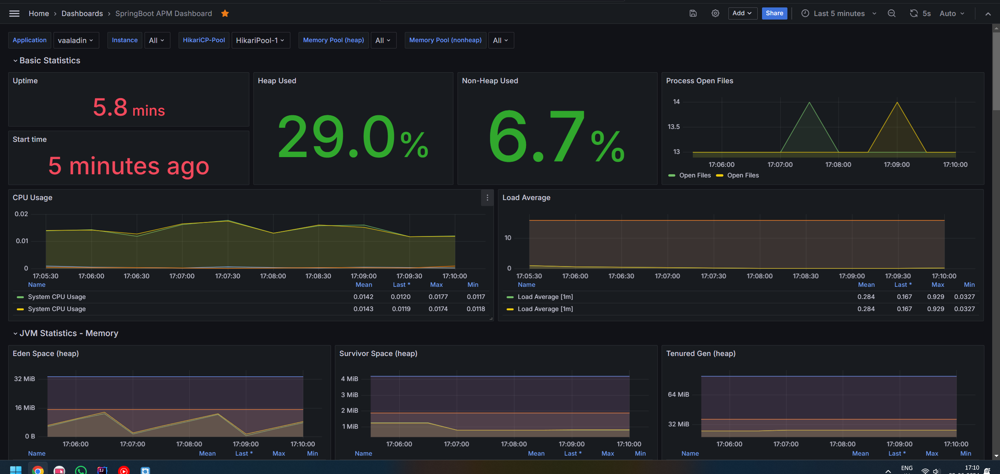

# Kick Starter Project for Vaadin and Spring Boot

This project can be used as a starting point to create your own Vaadin application with Spring Boot.
It contains all the necessary configuration and some placeholder files to get you started.

The best way to create your own project based on this starter is [start.vaadin.com](https://start.vaadin.com/) - you can
get only the necessary parts and choose the package naming you want to use.

## Deployment using Kubernetes

The application is packaged as Docker image which can be deployed as Docker compose or as a Kubernetes
deployment. Here we will demonstrate deployment using Kubernetes running as
a [Docker Desktop](https://www.docker.com/products/docker-desktop/) (just for fun ;-p). These are **NOT** a
recommendation
for a
production grade environment.

### Database

We will be using MySQL as our choice for the RDBMS. We will be using
the [MySQL Operator for Kubernetes](https://dev.mysql.com/doc/mysql-operator/en/) for deploying a simple single node
cluster

```commandline
kubectl create ns vaaladin
```

```commandline
helm repo add mysql-operator https://mysql.github.io/mysql-operator/
```

```commandline
helm repo update
```

```commandline
helm install mysql-operator mysql-operator/mysql-operator --namespace vaaladin
```

```commandline
helm upgrade --install vaaladin-mysql-db mysql-operator/mysql-innodbcluster -n vaaladin --values deployment/mysql-values.yaml
```

### NGINX Ingress

```commandline
kubectl apply -f https://raw.githubusercontent.com/kubernetes/ingress-nginx/main/deploy/static/provider/cloud/deploy.yaml
```

### Monitoring

We will be using https://artifacthub.io/packages/helm/prometheus-community/kube-prometheus-stack for monitoring, logging
and alerting requirements. This will help to profile a typical Vaadin application resources footprint under load.

```commandline
helm repo add grafana https://grafana.github.io/helm-charts
```

```commandline
helm repo add prometheus-community https://prometheus-community.github.io/helm-charts
```

```commandline
helm repo update
```

```commandline
helm install --values deployment/loki-values.yaml loki --namespace=vaaladin grafana/loki
```

```commandline
helm upgrade --install kube-prometheus-stack prometheus-community/kube-prometheus-stack -f deployment/prom-values.yaml -n vaaladin
```

Import [Grafana Dashboard](https://grafana.com/grafana/dashboards/12900-springboot-apm-dashboard/)



### Install Kafka using [Strimzi](https://strimzi.io/)

```commandline
kubectl create namespace kafka
```

```commandline
kubectl create -f 'https://strimzi.io/install/latest?namespace=kafka' -n kafka
```

```commandline
kubectl apply -f deployment\strimzi.yaml -n kafka
```